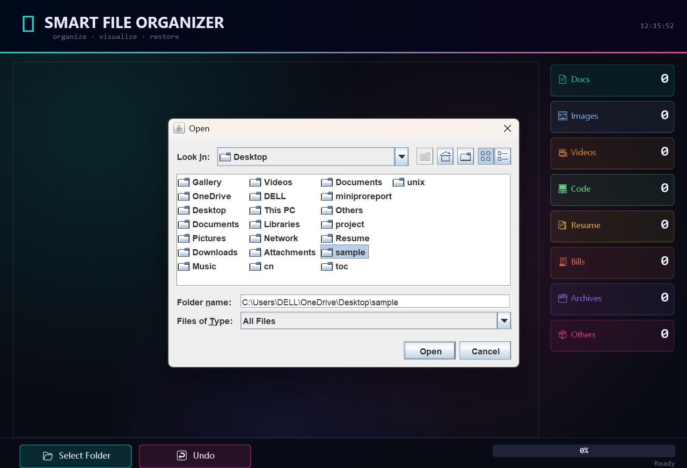
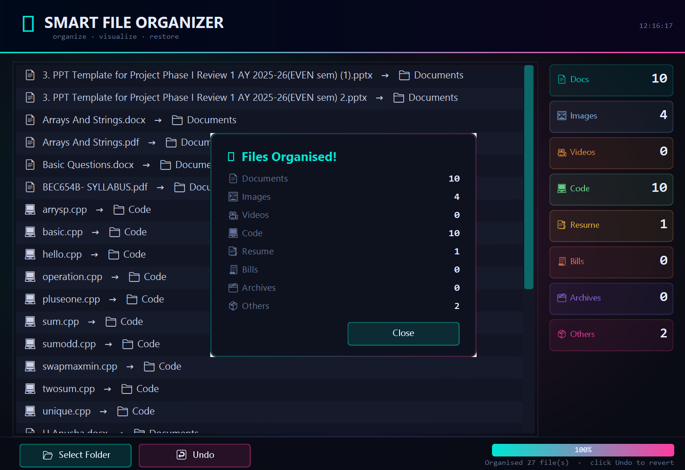

# 📁 Smart File Organizer

A Java-based desktop application that automatically organizes files into categorized folders based on their file types. Built using **Java Swing**, this application helps users keep their directories clean, organized, and easy to manage through a simple graphical interface.

---

# 📌 Project Overview

Managing large numbers of files manually can be time-consuming. The **Smart File Organizer** simplifies this process by scanning a selected folder, identifying file types, and automatically moving files into appropriate categories such as Documents, Images, Videos, Audio, Archives, and Others.

The project demonstrates Java programming concepts including Object-Oriented Programming (OOP), file handling, exception handling, and GUI development.

---

# ✨ Features

* 📂 Automatically organizes files by their extensions
* 🖥️ User-friendly graphical interface built with Java Swing
* 📁 Creates folders automatically if they do not exist
* 📄 Supports multiple file formats
* ⚡ Fast and efficient file organization
* 🧹 Helps maintain a clean directory structure
* 💻 Cross-platform desktop application
* 🔄 Easy folder selection

---

# 🛠️ Technologies Used

## Programming Language

* Java

## GUI Framework

* Java Swing

## Java Concepts

* Object-Oriented Programming (OOP)
* File Handling
* Exception Handling
* Collections Framework
* Packages

---

# 📂 Project Structure

```text
Smart-File-Organizer/
│
├── app/
│   └── Main.java
│
├── logic/
│   └── FileOrganizer.java
│
├── ui/
│   ├── MainUI.java
│   └── screenshot/
│       ├── fileselection.png
│       └── organized-files.png
│
├── utils/
│   └── FileUtils.java
│
├── README.md
└── .gitignore
```

---

# ⚙️ How It Works

1. Launch the application.
2. Select the folder you want to organize.
3. The application scans all files in the selected folder.
4. Files are identified based on their extensions.
5. Category folders are created automatically (if required).
6. Files are moved into their respective folders.
7. A success message is displayed after the organization is completed.

---

# 📁 Supported File Categories

* 🖼️ Images
* 📄 Documents
* 🎵 Audio
* 🎬 Videos
* 📦 Archives
* 💻 Executable Files
* 📁 Others

---

# ▶️ Running the Application

Compile the project:

```bash
javac app/Main.java logic/FileOrganizer.java ui/MainUI.java utils/FileUtils.java
```

Run the application:

```bash
java app.Main
```

---

# 📸 Screenshots

## Folder Selection



---

## Files Organized Successfully



---

# 🚀 Future Enhancements

* Duplicate file detection
* Undo organization operation
* Custom file categories
* Drag-and-drop folder selection
* Dark mode support
* File preview
* Automatic scheduled organization
* Search functionality
* Cloud storage integration

---


